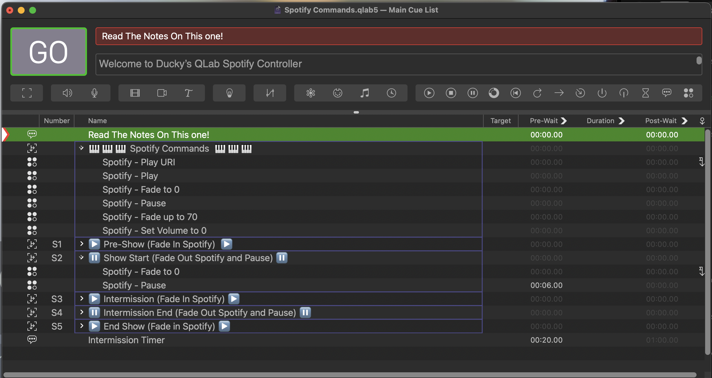

# QLab Spotify Commands
This is a QLab File containing a collection of Cues that use AppleScript to control the Spotify App.

# How to Use
Download the QLab Spotify Commands file from here.
The file was created in QLab Version 5.4.9.  You will require a paid version of QLab to use this (any licence type is fine, as long as it's a paid one).

Select any of the cues and copy/paste them to your own Cue list.  I've included some examples (for use in a theatre with Preshow/Intermission etc) that will Set Volume to 0, Play a track and fade the volume up to 70% over 5 seconds (these values can be changed easily).
Instructions are included in the Notes sections of the cues.

# How does it work?
It's using AppleScript to talk to the Spotify App (note, Spotify must be running!)

# Licencing
No licence, go nuts yo.

